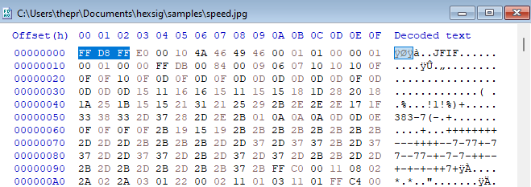
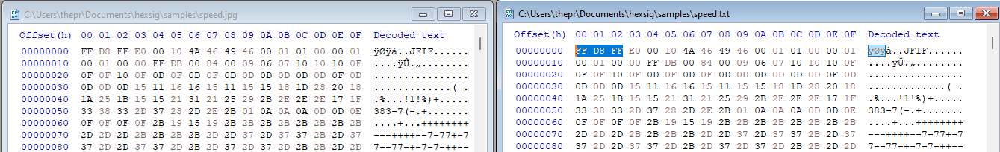

# Manual hex analysis

Before writing the tool, I analysed files by hand in a hex editor (HEX-EDITOR-NAME) to understand how file signatures work. The `hexsig` script automates what I did here.

## 1. JPG file

File: `samples/speed.jpg`

- The first three bytes of the file are `FF D8 FF`. This is the JPEG signature (also called magic bytes), and it sits at offset `00000000`, the very start of the file.
- `FF D8` is the "start of image" marker. The third `FF` begins the next segment, which is why the signature is checked as three bytes rather than two.
- Every JPEG starts with these bytes regardless of its filename, so software can identify the format without trusting the extension.
- The byte after the signature (`E0` for JFIF, `E1` for Exif) says which kind of JPEG header follows. In the text column I could see `JFIF` / `Exif` (keep whichever you see) near the start.
- This is why my tool reads the first bytes of the file rather than looking at the extension. The extension can be changed to anything in seconds, but the signature is part of the file's contents.

- WHAT ELSE I NOTICED.
- After the signature `FF D8 FF`, the next byte is `E0` or `E1`. In the text column I could see `JFIF` (or `Exif`) just after the start of the file. This tells you which JPEG variant it is, and it's extra detail that comes after the signature rather than part of it.
- `FF D8` is the "start of image" marker, and the file ends with `FF D9`, the "end of image" marker. Pressing Ctrl+End in HxD took me straight to it.
- JPEG data is organised into segments, each beginning with a `FF` byte followed by a marker code. That's why `FF` shows up so often near the start of the file.
- Past the header, the text column is mostly dots and random symbols. The image data is compressed, so it doesn't look like readable text the way a plain `.txt` file would.

## 2. Renaming test

I copied `speed.jpg` and renamed the copy to `speed.txt`.

- The bytes in both files were identical. Only the filename changed.
- Windows treated `speed.txt` as a text file and would not open it as an image.
- The signature at the start of the file still showed the real type.

## 4. Takeaways

- A file extension is only a label. The contents decide the real file type.
- Mismatched extensions can be used to hide files, which is why signature checks are a standard forensics step.
- WHAT YOU LEARNED OR FOUND HARD.

## 5. How this led to the tool

I turned these steps into `hexsig.py`, which reads the first bytes of a file, identifies the type from its signature, and warns when the extension does not match.